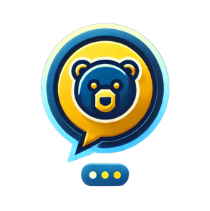

<h1> ChatGSPP</h1>

## Introduction

Welcome to **ChatGSPP**! This project is built on top of [PrivateGPT](https://github.com/your-repo/privategpt), a production-ready AI solution that enables you to ask questions about your documents using the power of Large Language Models (LLMs), even without an Internet connection. With 100% privacy, no data leaves your execution environment at any point.

## ChatGSPP Technical Overview

*To be filled out soon...*

## How to Run ChatGSPP

*To be filled out soon...*

## Documentation

Comprehensive documentation on installation, dependencies, configuration, running the server, deployment options, ingesting local documents, API details, and UI features can be found here: [ChatGSPP Documentation](https://docs.privategpt.dev/)

## Project Summary

**ChatGSPP** extends the capabilities of **PrivateGPT** into the world of website chatbots, conceptualizing it as an API that wraps a Retrieval Augmented Generation (RAG) pipeline and exposes its primitives.

### PrivateGPT Key Features

- **High-level API:**
  - **Ingestion of Documents:** Manages document parsing, splitting, metadata extraction, embedding generation, and storage internally.
  - **Chat & Completions:** Utilizes context from ingested documents, abstracting context retrieval, prompt engineering, and response generation.

- **Low-level API:**
  - **Embeddings Generation:** Generates embeddings based on text inputs.
  - **Contextual Chunks Retrieval:** Retrieves the most relevant chunks of text from ingested documents based on queries.

In addition to the API, **PrivateGPT** includes a working [Gradio UI](https://www.gradio.app/) client for testing the API, along with tools such as bulk model download scripts, ingestion scripts, and a documents folder watch feature.

## Partners & Supporters

**PrivateGPT** is actively supported by the teams behind:

- [Qdrant](https://qdrant.tech/): Providing the default vector database.
- [Fern](https://buildwithfern.com/): Offering Documentation and SDKs.
- [LlamaIndex](https://www.llamaindex.ai/): Supplying the base RAG framework and abstractions.

This project is strongly influenced and supported by other amazing projects such as:

- [LangChain](https://github.com/hwchase17/langchain)
- [GPT4All](https://github.com/nomic-ai/gpt4all)
- [LlamaCpp](https://github.com/ggerganov/llama.cpp)
- [Chroma](https://www.trychroma.com/)
- [SentenceTransformers](https://www.sbert.net/)

## Contact

For any questions, suggestions, or contributions, please reach out to GSPP's IT Team:

- **Email:** gspptechsupport@lists.berkeley.edu
- **GitHub Issues:** [ChatGSPP Issues](https://github.com/Dhall777/chatGSPP/issues)

---
